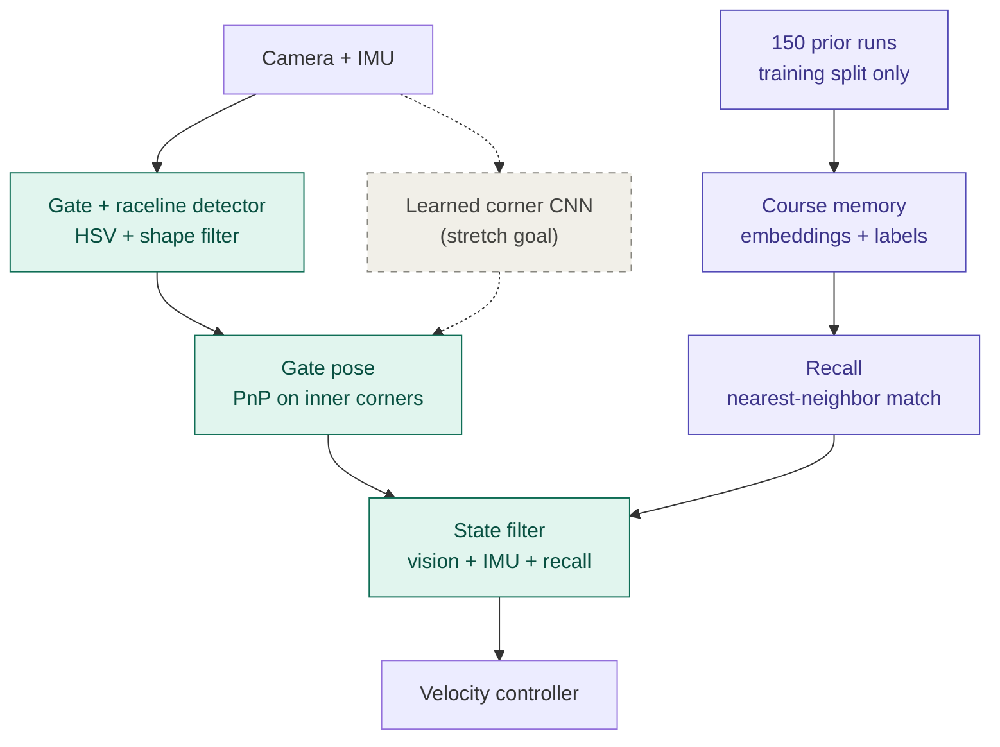
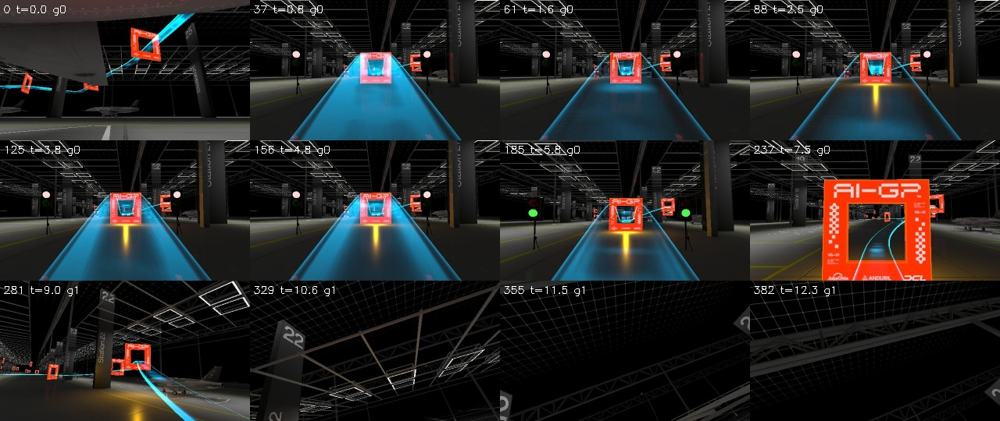
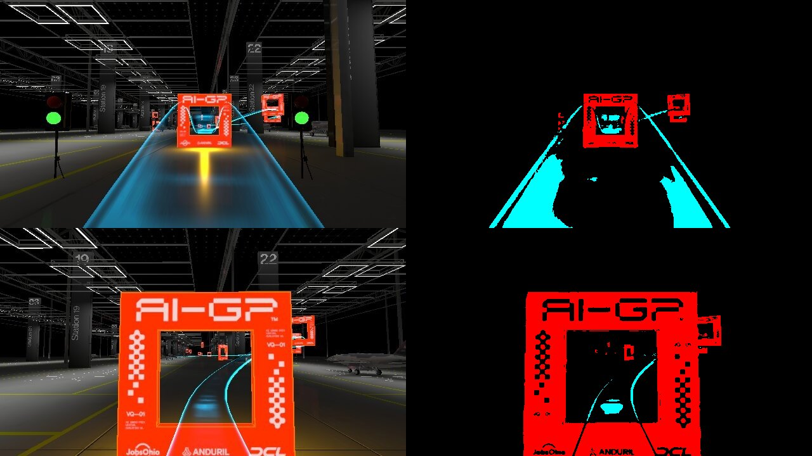

# Monocular Gate Perception with Course Memory for Autonomous Drone Racing

**CSE 60535 Graduate Computer Vision, Fall 2026: Semester Project**
Author(s): Jonathan Granda Acaro
Platform: AI Grand Prix virtual qualifier simulator (spec VADR-TS-003, issue 00.03)

---

# Semester Project, Part 1 (Conceptual Design)

## 1. Problem

The goal is to fly a simulated quadrotor through a course of about 20 race gates autonomously, using only a forward-facing camera (640×360, ~30 Hz) and an IMU. The simulator provides no GPS or position data, so on every frame the vision system must answer two questions: *where is the next gate relative to the drone*, and *where does the course go after it*? Gate appearance changes quickly with distance and approach angle, and the next gate is often out of view. Logged crashes happen while turning toward a gate not yet visible.

## 2. Proposed solution

The design is inspired by the competition's recommended pipeline (perception → state estimation → control). Instead of full visual SLAM, it combines live gate perception with a *course memory* recalled from past flights.

*Teal: core pipeline. Purple: course memory (research component). Dashed: stretch goal.*

- **Detection.** Gates are saturated orange-red squares in a mostly gray scene, and the racing line is a bright cyan ribbon. Color thresholding followed by a shape check (four corners, known proportions) finds candidate gates. The raceline gives a look-ahead direction.
- **Pose.** The gate's size is known, so its four inner corners are enough to recover its position and orientation relative to the camera (PnP).
- **Course memory.** The course is identical on every flight. Past frames are stored as image embeddings, linked to what came next (active gate, where the next gate appeared). During flight, the current frame is matched to its most similar stored frames, giving a guess of where the next gate is even when it is not visible. The memory recalls *place*, not *action*.
- **State estimation and control.** A Kalman filter fuses detection, IMU and recall. A simple controller then steers toward the estimated gate.
- **Stretch goal.** After the core works, a corner-predicting CNN will be compared against the color detector.

## 3. Research component

The research question is whether fusing live perception (a hand-crafted detector) with recalled course knowledge (data-driven retrieval) localizes the next gate better than either source alone. Detection is precise when a gate is visible but useless when it is off-screen; recall works regardless of visibility but is only as good as its match to past flights. Each source reports an uncertainty (detection quality for detection, match distance for recall) that the filter uses to weight it. Ablations will compare detection only, recall only, and the fused system on:

- gate-localization error against annotated corners,
- re-acquisition error: where recall predicted an off-screen gate versus where it is detected on reappearing,
- closed-loop gates passed.

## 4. Invariances

The detector should tolerate changes in gate distance, viewing angle, drone roll, motion blur, lighting, background clutter, gates cut off at the image edge, and JPEG artifacts. With several gates visible at once, it must pick the *next* one. Recall must tolerate small viewpoint differences between flights while still telling similar-looking course sections apart. Neither should ignore hue, the strongest cue available.

## 5. Data

**Primary dataset: 150 logged Training-mode runs** from the simulator, each with camera frames, IMU samples, race status (active gate, gate-pass times) and timestamps.

- **Labels.** Gate corners will be hand-annotated on keyframes and propagated by the detector. Gate-pass events label the memory for free.
- **Splits.** Runs are split whole, about 105 / 22 / 23 for training, validation and test, because neighboring frames are nearly identical. The memory is built only from training runs, and test runs stay untouched until the final evaluation.
- **Coverage.** The best run reached gate 2 of about 20, so the memory will initially cover only the start of the course. Elsewhere the system falls back to detection alone.

**External datasets.**

- **UZH FPV Drone Racing Dataset** ([fpv.ifi.uzh.ch](https://fpv.ifi.uzh.ch/)): real aggressive flights with camera, IMU and ground truth, for testing the state filter under realistic noise.
- **DroNet** ([rpg.ifi.uzh.ch/dronet.html](https://rpg.ifi.uzh.ch/dronet.html)): learned steering from car and bicycle footage, related work on image-to-action learning, which this design avoids.

## 6. Relevant course material

| Course topic                                                   | Use in project                                           |
| -------------------------------------------------------------- | -------------------------------------------------------- |
| Color representation, segmentation (Part II, Practicum 1)      | Gate and raceline detector                               |
| Edge detection, morphology (Part II)                           | Contour cleanup                                          |
| Features, k-NN classification (Part III, Practicum 2)          | Recall by nearest-neighbor matching                      |
| CNN features, foundation models (Part III, Practicums 3 and 5) | Frame embeddings for course memory; corner CNN (stretch) |
| Pinhole model, projective geometry (Part IV, Practicum 6)      | PnP, homographies, camera tilt                           |
| Kalman filtering (Part IV)                                     | Fusing vision, IMU and recall                            |

---

## 7. Plan by project milestone

| Milestone                  | Deliverable                                                                                                     |
| -------------------------- | --------------------------------------------------------------------------------------------------------------- |
| Part 2: Data               | Fix logger (frame loss, IMU rate, log all message types); curate 150 runs; run-level splits; corner annotations |
| Part 3: First solution     | Classical detector + PnP evaluated offline on validation runs                                                   |
| Part 4: Final solution     | Course memory + recall, EKF fusion, closed-loop flight, ablations on known data                                 |
| Part 5: Final evaluation   | Fused vs. detection-only vs. recall-only on held-out test runs                                                  |
| Stretch (after core works) | Learned corner CNN vs. classical detector                                                                       |

---

## Appendix A: First capture analysis (`run_20260731_004531`)

### A.1 Contents

| File              | Rows   | Fields                                                                                                           |
| ----------------- | ------ | ---------------------------------------------------------------------------------------------------------------- |
| `frames/*.jpg`    | 916    | 640×360 JPEG, ~68 KB median; filename = `frame_id_simtimens`                                                     |
| `frames.csv`      | 916    | `frame_id, sim_time_ns, rx_wall, file, gate_index`                                                               |
| `imu.csv`         | 16,101 | `xacc..zgyro, time_usec, time, rx_wall`                                                                          |
| `race_status.csv` | 614    | `sim_boot_time_ms, race_start_boot_time_ms, race_finish_time_ns, active_gate_index, last_gate_race_time` (~4 Hz) |

### A.2 What the run contains

This Training-mode capture contains **four attempts**, each about 10.5 s long. The simulator restarted after each crash. In every attempt the drone passed gate 0 at 3.20–3.32 s race time. It then lost control while turning toward gate 1, which was not yet in view, and crashed. The camera stream stopped about 45 s in, during attempt 4.

### A.3 Findings

1. **No pose or attitude ground truth.** The log contains no attitude, position or gate-pose messages. It is still unclear whether Training mode blocks them or the logger never subscribed to them. The next capture will log every received message type to settle this.
2. **About 30% of camera frames are lost, evenly within every attempt.** The simulator produces frames at a 32 ms period (~31 Hz). Only 916 of 1,360 frame IDs arrived, and gaps reach 13 frames (~0.4 s). The losses are spread through each attempt rather than clustered at restarts, so they point to the logger, most likely UDP chunk loss during frame reassembly. Planned fix: a dedicated receive thread and a larger socket buffer.
3. **New IMU data arrives at only ~36 Hz.** Only 1,800 of 16,101 rows contain a new sample; the rest repeat stale ones. After the camera stopped, the logger wrote about 100 s of a single frozen sample. Rows will be de-duplicated on `time_usec`, and a higher rate will be requested with `SET_MESSAGE_INTERVAL`.
4. **The three streams use different clocks.**
  - Frame `sim_time_ns` is monotonic across restarts.
  - IMU `time_usec` and race-status boot time reset on every restart, which is expected.
  - Only `rx_wall` (receive time on the logging PC) is shared by all streams.
   Synchronization will use per-attempt offsets estimated against `rx_wall`.
5. **Suspicious gravity vector at rest.** Before takeoff, the accelerometer reads (−3.00, 0.00, −9.33) m/s². The magnitude, 9.80 m/s², is correct, but the direction implies an ~18° tilt about the y-axis. Either the drone spawns tilted, or the IMU axes differ from the body frame. This must be resolved before the EKF relies on gravity.
6. **Visual appearance.** The spec diagram shows blue gates; the rendered gates are orange-red. Gate faces carry text, checker patterns, logos and a gate ID, so the outer border is not uniform, but the inner edge is clean. Inner corners are therefore the better PnP targets. Distractors include:
  - up to about 5 gates visible at once,
  - cyan floor reflections of the raceline,
  - a yellow glow beneath gates,
  - start lights near the course.

---

## Use of generative AI

I used Claude (Anthropic) as a design and analysis assistant throughout Part 1. The division of work was as follows.

**My contributions**

- **The course-memory idea.** It came from the [Monday 9/14 lecture on color imaging](https://notredame.hosted.panopto.com/Panopto/Pages/Viewer.aspx?id=e22cb1d8-c938-45e1-976c-b4c5012ff0af). There I asked Professor Czajka whether memory affects how we visually perceive an image, and I saw a possible use for that idea in the drone pipeline.
- **The data.** I collected the 150 logged Training-mode runs from the simulator.
- **External datasets.** I researched and selected UZH FPV and DroNet.
- **The core problem framing.** I identified that the vision system must follow the raceline, detect the gates, and connect both to the system that flies the drone.
- **Review.** I reviewed and edited all AI-generated text and analysis, and I made the final decisions on the architecture, research question and datasets.

**How AI and its tools were used**

- **Data analysis.** Claude ran Python scripts (pandas, OpenCV) in a sandboxed environment on my first logged run. It measured frame rate and frame loss, found duplicated IMU samples and mismatched clocks across data streams, and flagged an unexpected gravity reading at rest. It also produced the contact-sheet and HSV-threshold figures in Appendix A.
- **Spec review.** It checked the simulator specification against the camera parameters and found that the stated 90° vertical field of view is actually the horizontal one.
- **Architecture refinement.** It helped me turn my ideas into a coherent high-level architecture. It suggested replacing full SLAM with a lighter design, having the memory recall *place* rather than *action*, and making the learned corner CNN a stretch goal. It also drew the architecture diagram.
- **Research question comparison.** It compared my memory-based research question with a more standard classical-vs-CNN detector comparison, which helped me see that my idea was more original and better matched the failures in my data. It also suggested two improvements: uncertainty weighting for recall, and a measurable re-acquisition metric.

# Semester project (Part 2): Data acquisition and preparation

# Part 2: Data Acquisition and Preparation

> **Status.** All 150 simulator runs have been collected. Only one, `run_20260731_004531`, has been analyzed so far (Appendix A). Every figure below comes from that run, the simulator spec or the UZH FPV website. Dataset-wide statistics have not been computed yet; P2.5 lists the steps that will produce them.

## P2.1 Sources

**Primary: AI Grand Prix simulator logs (collected by the author).**

- 150 Training-mode runs from the AI Grand Prix virtual qualifier simulator (spec VADR-TS-003, issue 00.03).
- Recorded with our own logger, which captures the MAVLink telemetry and the UDP camera stream.
- Each run contains `frames/*.jpg`, `frames.csv`, `imu.csv` and `race_status.csv` (Appendix A.1).
- Not public.

**Secondary: UZH FPV Drone Racing Dataset.**

- Link: [https://fpv.ifi.uzh.ch/](https://fpv.ifi.uzh.ch/)
- Paper: J. Delmerico, T. Cieslewski, H. Rebecq, M. Faessler, D. Scaramuzza, "Are We Ready for Autonomous Drone Racing? The UZH-FPV Drone Racing Dataset," *ICRA 2019*.
- License: CC BY-NC-SA 3.0.
- Use: tuning and testing the state filter (EKF) on real IMU noise with ground truth.

**Not used as data: DroNet** (Loquercio et al., *IEEE RA-L* 2018). It is related work only (Part 1, §5); its car and bicycle datasets contain no race gates.

## P2.2 Current state of the data

**Known from the analyzed run** (Appendix A):

- The run contains four attempts. Each passed gate 0, then crashed while turning toward gate 1.
- 916 of 1,360 camera frame IDs were received, so about 33% of frames were lost in the logger.
- New IMU samples arrive at about 36 Hz. Most logged rows repeat stale samples.
- The streams use different clocks. Only `rx_wall` is shared by all of them.
- No pose, attitude or gate-position ground truth was logged.
- The accelerometer at rest implies an ~18° tilt.
- The camera stream stopped during attempt 4, while the IMU and race status kept logging.

**Believed about the other 149 runs** (to be verified):

- Same file format and the same logger defects.
- Some runs reached gates 2–3; none reached further.
- The runs were flown with **different controller and CV pipeline versions**, because both were being iterated during collection. The runs are therefore not independent flights of one fixed system.

**Unknown until profiled:**

- Total attempts and frames.
- How many runs or attempts are unusable.
- Frames per gate.
- The date range and number of distinct pipeline versions.
- Whether logger defects vary across versions.
- Whether Training mode publishes pose or attitude messages at all.

## P2.3 How the data will be used

| Component (Part 1 architecture)        | Data used                                                                           | Split role                                                   |
| -------------------------------------- | ----------------------------------------------------------------------------------- | ------------------------------------------------------------ |
| HSV + shape gate detector              | Frames with annotated inner-gate corners                                            | Tune on train, evaluate on validation                        |
| PnP gate pose                          | Annotated inner corners + known gate size, as pose pseudo-ground truth              | Evaluate on validation                                       |
| Course memory                          | Train-run frames → embeddings, labeled from `race_status` (active gate, pass times) | Memory built from train only; queried with validation frames |
| Recall uncertainty                     | Match distances from validation queries against the train memory                    | Calibrate on validation                                      |
| EKF                                    | Sim IMU + detections + recall; UZH FPV IMU + ground truth for noise parameters      | UZH split in P2.4                                            |
| Ablations (detection / recall / fused) | Offline replay of logged runs                                                       | Development on validation; final on test                     |
| Closed-loop gates passed               | **New flights** with the Part 4 system                                              | Not from these logs (they reflect old controllers)           |

## P2.4 Split plan

The split has not been run yet.

- **Unit: whole runs.** Individual frames or attempts are never split, because neighboring frames are nearly identical.
- **Target: 90 / 30 / 30 runs (60 / 20 / 20).** This revises Part 1's 105 / 22 / 23 so that validation and test hold enough of the rare runs that reached gates 2–3.
- **Stratified by pipeline era × deepest gate reached,** so every split contains every era and every depth.
- **Frozen test set.** The split comes from a seeded script. Test run IDs are recorded with checksums and stay untouched until Part 5.

**Expected differences between splits that matter here:**

- **Same course, different flights.** Every split flies the identical course, which course memory depends on. The splits differ in trajectories, controller versions and crash points, not in the scene.
- **Recall on unseen flights.** Validation flights are unseen and flown differently, so they test whether recall matches *place* rather than replaying a stored trajectory. Because memory labels describe place, not action, they do not depend on which controller flew.
- **Depth.** Frames near gates 2–3 are rare, so stratification is what allows recall and re-acquisition to be evaluated beyond gate 1.
- **Logger defects.** Frame loss and IMU staleness come from the logger, not the scene. The profiler will check that they are balanced across splits.

**UZH FPV split.** All sequences are forward-facing with public ground truth; figures are from the dataset page.

| Split        | Sequences              | Duration (s)           | v_max (m/s)         | Rationale                       |
| ------------ | ---------------------- | ---------------------- | ------------------- | ------------------------------- |
| Tune (train) | Indoor fwd 3, 5, 9, 10 | 54.6, 50.0, 34.0, 33.4 | 9.5, 4.9, 11.4, 9.5 | Moderate speed                  |
| Validation   | Indoor fwd 6, 7        | 32.9, 73.2             | 12.5, 12.8          | Faster, same environment        |
| Test         | Outdoor fwd 1, 3, 5    | 49.6, 92.8, 22.2       | 8.6, 14.0, 20.7     | New environment, highest speeds |

## P2.5 Steps to make the data usable

1. **Inventory.** Check that every run folder has all four files, that the CSVs parse and that the JPEGs decode. List broken runs.
2. **Batch profiler →** `runs_manifest.csv`**.** Generalize the Appendix A analysis to all runs. For each attempt (segmented at sim resets), record:
  - frame count and frame loss;
  - the rate of new IMU samples;
  - the deepest gate reached and the race time at the gate-0 pass;
  - the gravity vector at rest;
  - whether the camera stream stopped early.
3. **Era and session tagging.**
  - Take each run's start time from `rx_wall`, cross-checked against the folder-name timestamp (local time, UTC+1).
  - **Era:** the last git commit touching controller or CV code before the run started, using author dates. Eras are approximate because some runs used uncommitted changes.
  - **Session:** a group of consecutive runs with no gap longer than about 30 minutes.
  - Spot-check a few runs by hand.
4. **Exclusion rules.** Set thresholds after looking at the profiler distributions, but before splitting and before any model results. Examples: minimum frames per attempt, maximum frame loss, camera stopped early. Report how many runs and attempts are removed.
5. **Cleaning.**
  - De-duplicate IMU rows on `time_usec`.
  - Assign an attempt ID to every row.
  - Estimate per-attempt clock offsets against `rx_wall`.
  - Store cleaned data in a standard per-attempt format that the replay harness loads.
6. **Split.** Run the seeded, stratified split, write the split files and freeze the test set.
7. **Labels.**
  - **Course memory (automatic):** active gate, gate-pass times and time-to-next-pass for each frame, from `race_status`.
  - **Visibility (semi-automatic):** full, partial or no gate. Pre-filled by the HSV detector, then corrected by hand.
  - **Corners (manual):** inner-gate corners on keyframes. Validation comes first, then a small training subset for tuning the detector. The first frame after each gate reappears is also labeled, for the re-acquisition metric. Test runs are annotated only before Part 5.
  - **Pose pseudo-ground truth:** PnP on the annotated corners, using the known gate size.
8. **Logger audit capture.** Record one new run that logs every MAVLink message type. This settles whether pose or attitude is available in Training mode. If it is, record a small supplementary set with real ground truth to check the PnP pseudo-ground truth against.
9. **Resolve the gravity tilt.** Determine whether the drone spawns tilted or the IMU axes differ from the body frame, before the EKF uses gravity.
10. **UZH FPV preparation.** Download the text-format (ZIP) sequences listed in P2.4 and their calibration files. Load the IMU and ground truth into the same format the EKF test harness uses.

## P2.6 Composition (to be reported)

The objects are the **race gates**. The course has about 20 gates; the logs are expected to contain only gates 0–3. Frames with no gate visible, from turns and crashes, are kept as negatives. After steps 2–7, the report will give:

- runs, attempts and frames after exclusion, overall and per split;
- for each gate: attempts reaching it, frames as the active gate, frames visible (full or partial) and annotated keyframes;
- the number of frames with no gate visible;
- the number of eras and sessions, and runs per era.

In the analyzed run, gate 0 was the active gate in all four attempts and gate 1 became active after each gate-0 pass. Gate 1 was never passed.

## P2.7 Sample properties

**Simulator logs** (measured on the analyzed run unless marked "spec"):

| Property     | Value                                                                                                                         |
| ------------ | ----------------------------------------------------------------------------------------------------------------------------- |
| Camera       | Single forward-facing RGB, 640×360 JPEG (~68 KB median)                                                                       |
| Intrinsics   | fx = fy = 320 px; HFoV 90°, VFoV ≈ 58.7°. The spec's stated 90° VFoV is actually the horizontal FoV.                          |
| Frame rate   | ~31 Hz produced (32 ms period); ~33% lost by the logger                                                                       |
| IMU          | 3-axis accelerometer and gyroscope, ~36 Hz new samples; `time_usec` resets every attempt                                      |
| Race status  | ~4 Hz: active gate, race start, last gate-pass time                                                                           |
| Ground truth | None logged                                                                                                                   |
| Scene        | Rendered indoor hangar: dark background, lit ceiling grid, pillars; synthetic lighting                                        |
| Gates        | Orange-red square frames with printed text, logos and gate ID; clean inner edge                                               |
| Distractors  | Up to ~5 gates visible at once, cyan raceline and its floor reflections, yellow glow beneath gates, start lights, red signage |

**UZH FPV** (from the dataset page):

- Real quadrotor flights by an expert pilot, indoors (hangar) and outdoors, with natural lighting.
- Sensors: mDAVIS (frames, events, IMU) and Snapdragon Flight (camera, IMU).
- Ground truth: Leica total station.
- Calibration: Kalibr camera intrinsics and camera–IMU extrinsics.

## P2.8 Risks and open questions

- **No pose ground truth.** If Training mode exposes no pose, evaluation relies on corner annotations and PnP pseudo-ground truth. Pose error is then measured against an estimate, not the true pose.
- **Approximate eras.** Uncommitted changes blur version boundaries. Stratification by session limits the damage.
- **Shallow coverage.** Memory and evaluation cover only the first few of about 20 gates. Deeper course sections fall back to detection only.
- **Logger defects.** If frame loss or IMU staleness differ by era, they confound comparisons across eras. The profiler checks this.
- **Annotation effort.** Corner labeling is the largest manual cost. It is limited to keyframes and prioritized for validation.
- **Sim-to-real gap.** UZH FPV tests the EKF on real IMU noise, but its camera, scene and dynamics differ from the simulator's.

## P2.9 Use of generative AI (Part 2)

Claude (Anthropic) analyzed the example run (Appendix A) and helped draft this plan. It suggested era and session tagging, depth-stratified splits and the preparation steps. I made the decisions on splits, exclusion rules and annotation. No statistics for the full dataset have been computed yet.