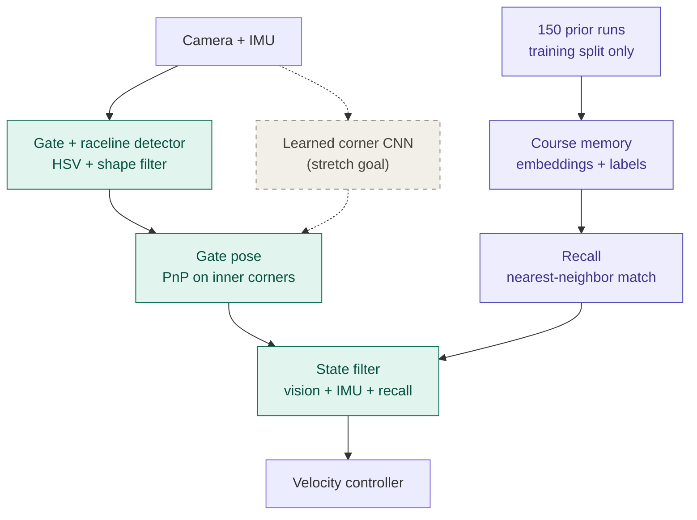
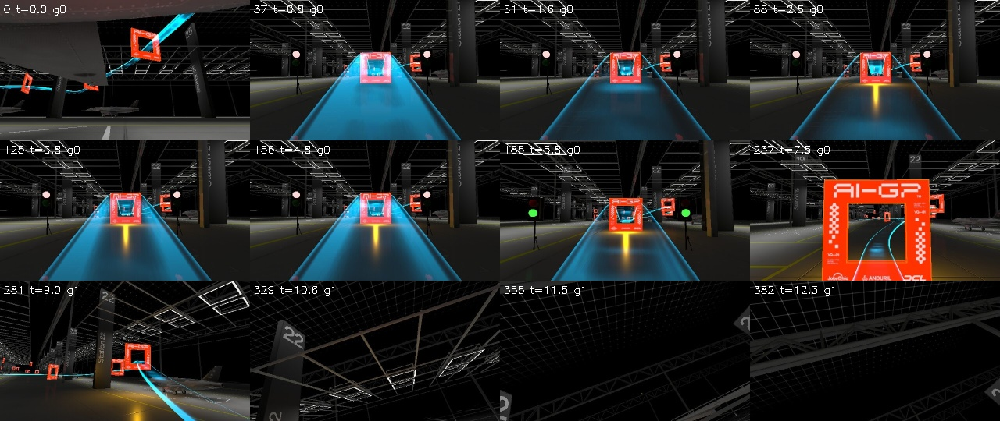
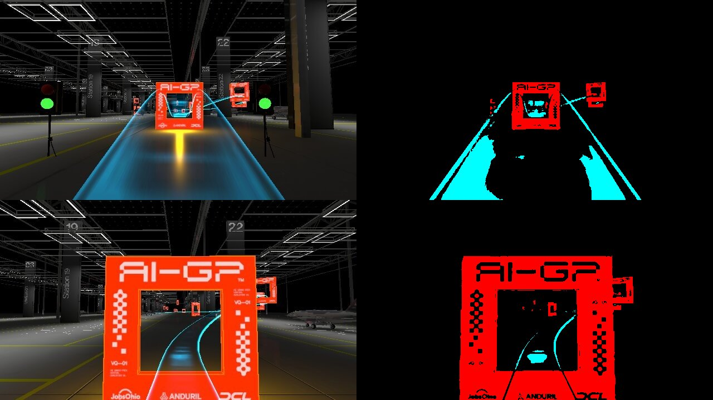

# Monocular Gate Perception with Course Memory for Autonomous Drone Racing

**CSE 60535 Graduate Computer Vision, Fall 2026: Semester Project, Part 1 (Conceptual Design)**
Author(s): Jonathan Granda Acaro
Platform: AI Grand Prix virtual qualifier simulator (spec VADR-TS-003, issue 00.03)

---

## 1. Problem

The goal is to fly a simulated quadrotor through a course of about 20 race gates autonomously, using only a forward-facing camera (640×360, ~30 Hz) and an IMU. The simulator provides no GPS or position data, so on every frame the vision system must answer two questions: *where is the next gate relative to the drone*, and *where does the course go after it*? Gate appearance changes quickly with distance and approach angle, and the next gate is often out of view. Logged crashes happen while turning toward a gate not yet visible.

## 2. Proposed solution

The design is inspired by the competition's recommended pipeline (perception → state estimation → control). Instead of full visual SLAM, it combines live gate perception with a *course memory* recalled from past flights.

*Teal: core pipeline. Purple: course memory (research component). Dashed: stretch goal.*

- **Detection.** Gates are saturated orange-red squares in a mostly gray scene, and the racing line is a bright cyan ribbon. Color thresholding followed by a shape check (four corners, known proportions) finds candidate gates. The raceline gives a look-ahead direction.
- **Pose.** The gate's size is known, so its four inner corners are enough to recover its position and orientation relative to the camera (PnP).
- **Course memory.** The course is identical on every flight. Past frames are stored as image embeddings, linked to what came next (active gate, where the next gate appeared). During flight, the current frame is matched to its most similar stored frames, giving a guess of where the next gate is even when it is not visible. The memory recalls *place*, not *action*.
- **State estimation and control.** A Kalman filter fuses detection, IMU and recall. A simple controller then steers toward the estimated gate.
- **Stretch goal.** After the core works, a corner-predicting CNN will be compared against the color detector.

## 3. Research component

The research question is whether fusing live perception (a hand-crafted detector) with recalled course knowledge (data-driven retrieval) localizes the next gate better than either source alone. Detection is precise when a gate is visible but useless when it is off-screen; recall works regardless of visibility but is only as good as its match to past flights. Each source reports an uncertainty (detection quality for detection, match distance for recall) that the filter uses to weight it. Ablations will compare detection only, recall only, and the fused system on:

- gate-localization error against annotated corners,
- re-acquisition error: where recall predicted an off-screen gate versus where it is detected on reappearing,
- closed-loop gates passed.

## 4. Invariances

The detector should tolerate changes in gate distance, viewing angle, drone roll, motion blur, lighting, background clutter, gates cut off at the image edge, and JPEG artifacts. With several gates visible at once, it must pick the *next* one. Recall must tolerate small viewpoint differences between flights while still telling similar-looking course sections apart. Neither should ignore hue, the strongest cue available.

## 5. Data

**Primary dataset: 150 logged Training-mode runs** from the simulator, each with camera frames, IMU samples, race status (active gate, gate-pass times) and timestamps.

- **Labels.** Gate corners will be hand-annotated on keyframes and propagated by the detector. Gate-pass events label the memory for free.
- **Splits.** Runs are split whole, about 105 / 22 / 23 for training, validation and test, because neighboring frames are nearly identical. The memory is built only from training runs, and test runs stay untouched until the final evaluation.
- **Coverage.** The best run reached gate 2 of about 20, so the memory will initially cover only the start of the course. Elsewhere the system falls back to detection alone.

**External datasets.**

- **UZH FPV Drone Racing Dataset** ([fpv.ifi.uzh.ch](https://fpv.ifi.uzh.ch/)): real aggressive flights with camera, IMU and ground truth, for testing the state filter under realistic noise.
- **DroNet** ([rpg.ifi.uzh.ch/dronet.html](https://rpg.ifi.uzh.ch/dronet.html)): learned steering from car and bicycle footage, related work on image-to-action learning, which this design avoids.

## 6. Relevant course material

| Course topic                                                   | Use in project                                           |
| -------------------------------------------------------------- | -------------------------------------------------------- |
| Color representation, segmentation (Part II, Practicum 1)      | Gate and raceline detector                               |
| Edge detection, morphology (Part II)                           | Contour cleanup                                          |
| Features, k-NN classification (Part III, Practicum 2)          | Recall by nearest-neighbor matching                      |
| CNN features, foundation models (Part III, Practicums 3 and 5) | Frame embeddings for course memory; corner CNN (stretch) |
| Pinhole model, projective geometry (Part IV, Practicum 6)      | PnP, homographies, camera tilt                           |
| Kalman filtering (Part IV)                                     | Fusing vision, IMU and recall                            |

---

## 7. Plan by project milestone

| Milestone                  | Deliverable                                                                                                     |
| -------------------------- | --------------------------------------------------------------------------------------------------------------- |
| Part 2: Data               | Fix logger (frame loss, IMU rate, log all message types); curate 150 runs; run-level splits; corner annotations |
| Part 3: First solution     | Classical detector + PnP evaluated offline on validation runs                                                   |
| Part 4: Final solution     | Course memory + recall, EKF fusion, closed-loop flight, ablations on known data                                 |
| Part 5: Final evaluation   | Fused vs. detection-only vs. recall-only on held-out test runs                                                  |
| Stretch (after core works) | Learned corner CNN vs. classical detector                                                                       |

---

## Appendix A: First capture analysis (`run_20260731_004531`)

### A.1 Contents

| File              | Rows   | Fields                                                                                                           |
| ----------------- | ------ | ---------------------------------------------------------------------------------------------------------------- |
| `frames/*.jpg`    | 916    | 640×360 JPEG, ~68 KB median; filename = `frame_id_simtimens`                                                     |
| `frames.csv`      | 916    | `frame_id, sim_time_ns, rx_wall, file, gate_index`                                                               |
| `imu.csv`         | 16,101 | `xacc..zgyro, time_usec, time, rx_wall`                                                                          |
| `race_status.csv` | 614    | `sim_boot_time_ms, race_start_boot_time_ms, race_finish_time_ns, active_gate_index, last_gate_race_time` (~4 Hz) |

### A.2 What the run contains

This Training-mode capture contains **four attempts**, each about 10.5 s long. The simulator restarted after each crash. In every attempt the drone passed gate 0 at 3.20–3.32 s race time. It then lost control while turning toward gate 1, which was not yet in view, and crashed. The camera stream stopped about 45 s in, during attempt 4.

### A.3 Findings

1. **No pose or attitude ground truth.** The log contains no attitude, position or gate-pose messages. It is still unclear whether Training mode blocks them or the logger never subscribed to them. The next capture will log every received message type to settle this.
2. **About 30% of camera frames are lost, evenly within every attempt.** The simulator produces frames at a 32 ms period (~31 Hz). Only 916 of 1,360 frame IDs arrived, and gaps reach 13 frames (~0.4 s). The losses are spread through each attempt rather than clustered at restarts, so they point to the logger, most likely UDP chunk loss during frame reassembly. Planned fix: a dedicated receive thread and a larger socket buffer.
3. **New IMU data arrives at only ~36 Hz.** Only 1,800 of 16,101 rows contain a new sample; the rest repeat stale ones. After the camera stopped, the logger wrote about 100 s of a single frozen sample. Rows will be de-duplicated on `time_usec`, and a higher rate will be requested with `SET_MESSAGE_INTERVAL`.
4. **The three streams use different clocks.**
  - Frame `sim_time_ns` is monotonic across restarts.
  - IMU `time_usec` and race-status boot time reset on every restart, which is expected.
  - Only `rx_wall` (receive time on the logging PC) is shared by all streams.
   Synchronization will use per-attempt offsets estimated against `rx_wall`.
5. **Suspicious gravity vector at rest.** Before takeoff, the accelerometer reads (−3.00, 0.00, −9.33) m/s². The magnitude, 9.80 m/s², is correct, but the direction implies an ~18° tilt about the y-axis. Either the drone spawns tilted, or the IMU axes differ from the body frame. This must be resolved before the EKF relies on gravity.
6. **Visual appearance.** The spec diagram shows blue gates; the rendered gates are orange-red. Gate faces carry text, checker patterns, logos and a gate ID, so the outer border is not uniform, but the inner edge is clean. Inner corners are therefore the better PnP targets. Distractors include:
  - up to about 5 gates visible at once,
  - cyan floor reflections of the raceline,
  - a yellow glow beneath gates,
  - start lights near the course.

---

## Use of generative AI

I used Claude (Anthropic) as a design and analysis assistant throughout Part 1. The division of work was as follows.

**My contributions**

- **The course-memory idea.** It came from the [Monday 9/14 lecture on color imaging](https://notredame.hosted.panopto.com/Panopto/Pages/Viewer.aspx?id=e22cb1d8-c938-45e1-976c-b4c5012ff0af). There I asked Professor Czajka whether memory affects how we visually perceive an image, and I saw a possible use for that idea in the drone pipeline.
- **The data.** I collected the 150 logged Training-mode runs from the simulator.
- **External datasets.** I researched and selected UZH FPV and DroNet.
- **The core problem framing.** I identified that the vision system must follow the raceline, detect the gates, and connect both to the system that flies the drone.
- **Review.** I reviewed and edited all AI-generated text and analysis, and I made the final decisions on the architecture, research question and datasets.

**How AI and its tools were used**

- **Data analysis.** Claude ran Python scripts (pandas, OpenCV) in a sandboxed environment on my first logged run. It measured frame rate and frame loss, found duplicated IMU samples and mismatched clocks across data streams, and flagged an unexpected gravity reading at rest. It also produced the contact-sheet and HSV-threshold figures in Appendix A.
- **Spec review.** It checked the simulator specification against the camera parameters and found that the stated 90° vertical field of view is actually the horizontal one.
- **Architecture refinement.** It helped me turn my ideas into a coherent high-level architecture. It suggested replacing full SLAM with a lighter design, having the memory recall *place* rather than *action*, and making the learned corner CNN a stretch goal. It also drew the architecture diagram.
- **Research question comparison.** It compared my memory-based research question with a more standard classical-vs-CNN detector comparison, which helped me see that my idea was more original and better matched the failures in my data. It also suggested two improvements: uncertainty weighting for recall, and a measurable re-acquisition metric.

